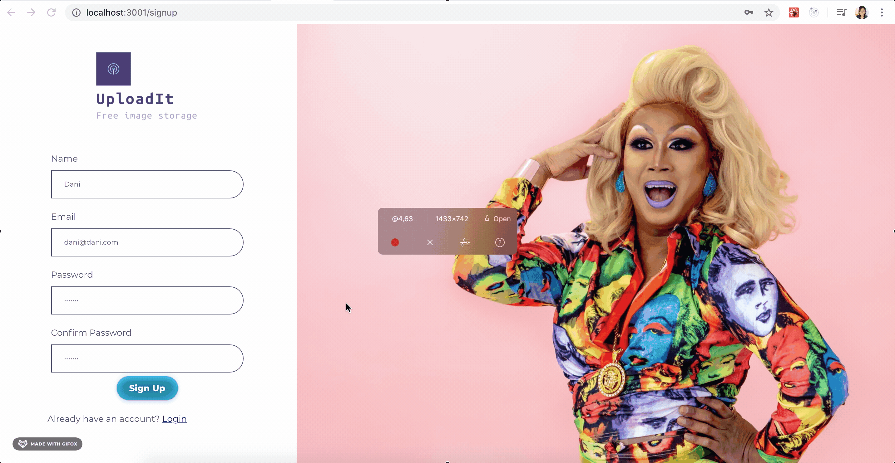
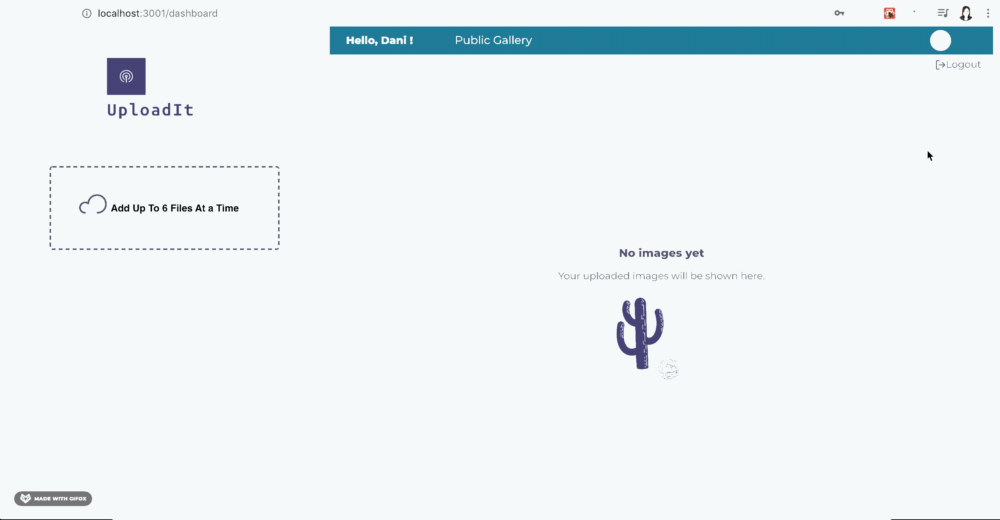
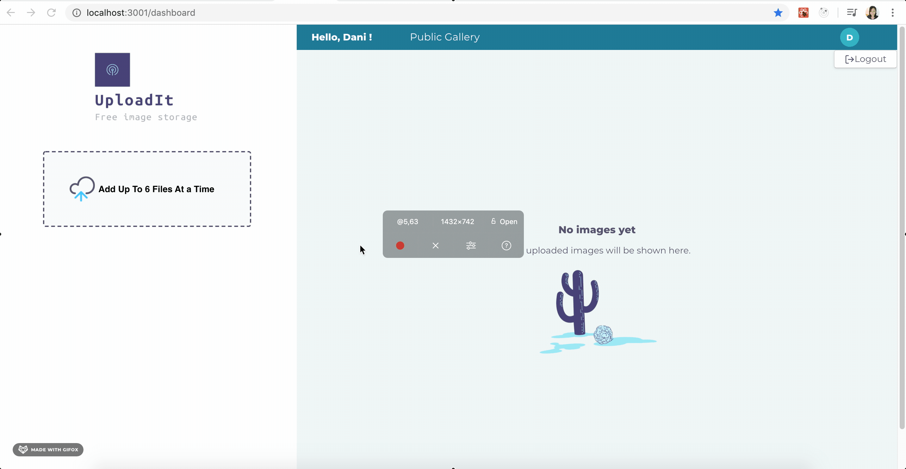
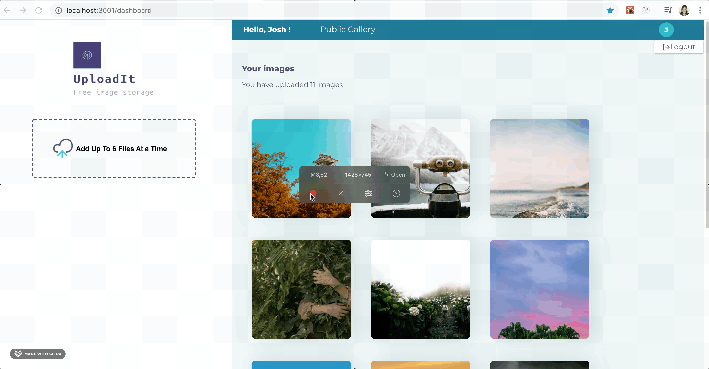
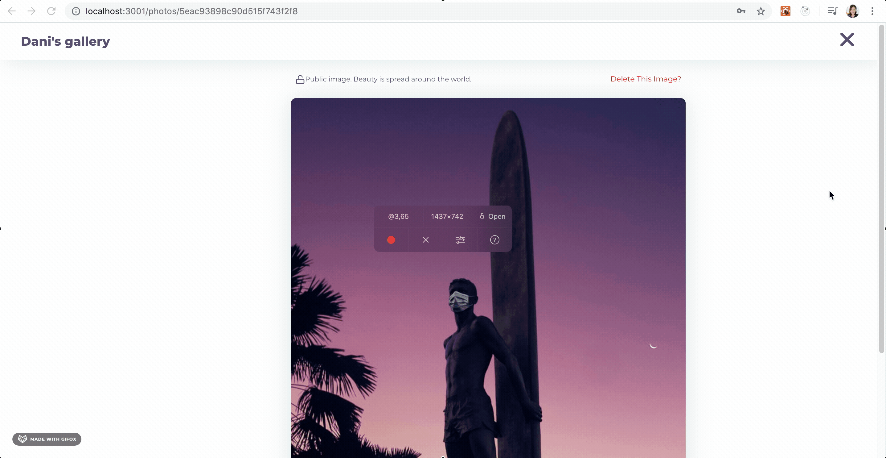
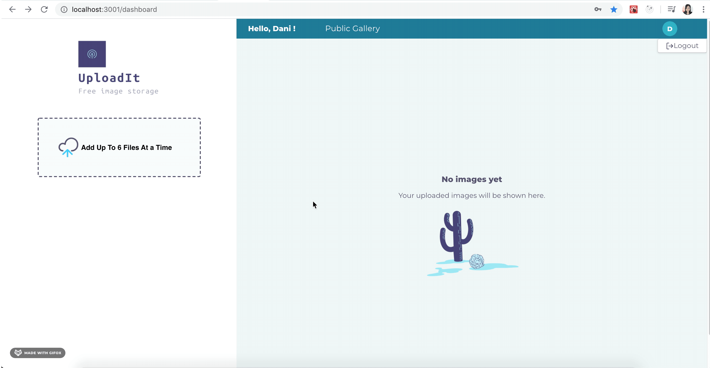

## Image Uploader

`UploadIt` is a webapp that allows users to upload pictures. They can upload images of up to 100kbs. The images are set to be private by default, but users can make them public if they want their images to be added to the Public Image gallery.

## Running the project
Go to the server directory. Run `npm install` followed by `npm run dev`. The server will be running on port `3000`

Go to the `client` directory. Run `npm install`followed by `npm run start`.
Accept to listen to FE on port `3001`.

## User Flow

### Log In

- User Login With Error

- Successful User Login

- On Click, navigate to Sign Up Page

###  Sign Up / Creating an Account

- Error: when passwords do not match

- Successful Sign Up

### Logging Out

### Uploading Images to the Gallery

- Uploading 1 image:
  

- Uploading 6 images:
 

### Change Image Privacy Settings
- Making it Public
 

- Accesing it via Public Gallery Link

- Another User(Dani) Can See it Now:

### Delete Image

### Public Gallery

- Empty State (No Users have published pics)

- With Public Images Added:

